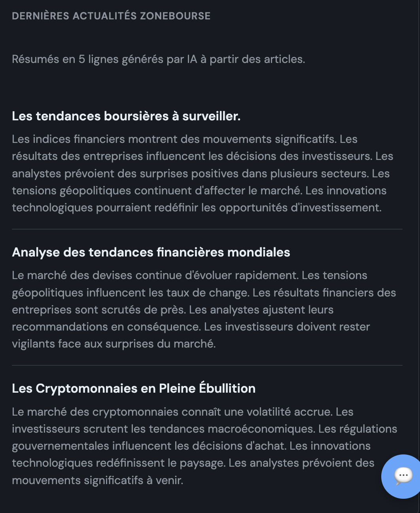
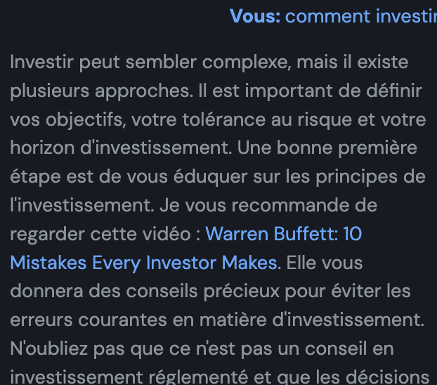
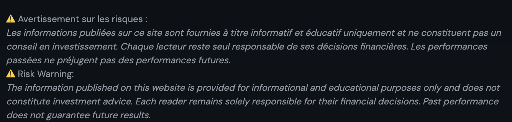

# eToro Interface

Interface web pour visualiser le profil d'un trader eToro, comparer les performances avec des indices (S&P 500, NASDAQ 100, CAC 40 TR, MSCI World) et lister les instruments par place de marché.

## Fonctionnalités

- **Profil trader** : affichage du profil, des gains mensuels/annuels et du portefeuille
- **Comparaison des performances** : courbes comparatives (base 100) avec possibilité d'ajouter les 100 traders les plus copiés. La liste déroulante est fermée par défaut (affichage « — Choisir un trader — ») ; après sélection et ajout, `blur()` est appliqué pour refermer la liste.
- **Indices** : S&P 500, NASDAQ 100, CAC 40 TR, MSCI World
- **Simulation DCA** : 1 000 $ au départ + 100 $/mois, comparaison avec le S&P 500
- **Posts par mois** (graphique 3) : comparaison du nombre de posts. Priorité au feed utilisateur (tous les posts) ; si vide, fallback sur plusieurs instruments (NSDQ100, SPX500, CAC40, Or, BTC, ETH) en filtrant par auteur
- **Performance vs copieurs** (graphique 5) : nuage de points pour les 2000 traders les plus copiés (abscisse = copieurs, ordonnée = performance % sur 2 ans)
- **Actualités Zonebourse** : résumés des articles générés par IA (5 lignes par article) et illustration sous chaque actualité (génération d’image via OpenAI DALL·E 3, même clé `OPENAI_API_KEY`)
- **Actualités par instrument** : sous les posts Zonebourse, les 3 dernières actualités Mediastack pour les instruments du portefeuille du trader (RomainRoth). Traduction automatique en français via OpenAI.
- **Chatbot agent IA** : assistant pédagogique en éducation financière pour poser des questions sur les données eToro et Zonebourse. Elle ajoute :
  - conformité AMF / régulation financière
  - prévention promesses de rendement
  - interdiction fraude / évasion fiscale
  - gestion risques utilisateurs
  - positionnement éducation financière plutôt que conseil

Avec ce prompt ton chatbot devient : **conforme fintech**, **compatible AMF / MiFID II**, **safe juridiquement**, **utilisable dans un produit SaaS**.

### Limiter les requêtes (rate limit par visiteur)

Les appels à `/api/chat` sont limités par **visiteur anonyme** (identifiant stocké côté navigateur) :

| Fenêtre | Limite |
|---------|--------|
| 1 minute | 5 messages |
| 1 heure | 30 messages |
| 24 heures | 100 messages |

Si la limite est dépassée, l'API renvoie `429 Too Many Requests`. Les limites sont configurables dans `app.py` (`CHAT_RATE_LIMIT`).

> **Pas de cooldown** : le temps de réponse de l’IA est déjà suffisant pour espacer naturellement les requêtes.

> **Possibilité : limiter par session courte** — Par exemple : 10 messages gratuits par session, puis blocage temporaire pendant 1 heure. C'est simple pour un chatbot public.

**Identifiant visiteur** : à la première visite, le backend génère un `visitor_id` aléatoire (UUID) et le stocke dans un **cookie HTTP-only** (durée 1 an). Le rate limit s'applique par `visitor_id`. Un visiteur derrière un NAT a son propre quota, distinct des autres. Supprimer le cookie ou utiliser un autre navigateur/onglet privé réinitialise le compteur.

### CAPTCHA (anti-bots)

Un CAPTCHA (reCAPTCHA v2) est demandé **uniquement au moment opportun** pour ne pas gêner les vrais utilisateurs :

| Condition | Déclenchement |
|-----------|---------------|
| Après 5 messages | Une fois 5 messages envoyés (fenêtre 24 h), le CAPTCHA est demandé pour le suivant |
| Rythme trop rapide | Si 3 messages ou plus en 1 minute |
| Requêtes similaires | Si le message est identique ou très proche d'un des 2 derniers |

*C'est très efficace contre les bots* : les utilisateurs légitimes ne voient généralement pas de CAPTCHA sur leurs premiers échanges ; les scripts automatisés qui envoient des messages en rafale ou répétés sont bloqués.

**Configuration** : ajouter dans `.env` les clés reCAPTCHA v2 (checkbox) :
- `RECAPTCHA_SITE_KEY` – clé publique
- `RECAPTCHA_SECRET_KEY` – clé secrète

Sans ces clés, le CAPTCHA n'est pas activé. Obtenir les clés : [Google reCAPTCHA Admin](https://www.google.com/recaptcha/admin).

> **Note** : La clé actuelle est configurée pour le domaine **romainroth.com**. Pour un autre domaine, créer de nouvelles clés reCAPTCHA.

> **Détecter les comportements anormaux** — Vous pouvez refuser ou ralentir les requêtes si : requêtes trop rapides, copier-coller de prompts énormes, mêmes messages répétés, user-agent étrange, ou trop de tokens demandés. Constantes dans `app.py` :
> - `MAX_USER_MESSAGE_CHARS = 2000`
> - `MAX_ESTIMATED_TOKENS = 12000`
> - `SUSPICIOUS_UA_SUBSTRINGS = ("curl", "python", "wget", "httpie", "bot", "scrapy", "requests/")`

> **Limiter la taille des messages** : `MAX_USER_MESSAGE_CHARS` (message utilisateur), `MAX_REPLY_CHARS` (troncature réponse), `MAX_HISTORY_MESSAGES` (historique envoyé au modèle), `MAX_COMPLETION_TOKENS` (max_tokens API).

### Récupérer les données du chatbot

Chaque question posée et chaque réponse sont enregistrées dans `data/chat_questions.jsonl` (format JSONL : une ligne par échange, avec `timestamp`, `question`, `reply`).

**API :**

| URL | Format | Description |
|-----|--------|-------------|
| `GET /api/chat-questions` | JSON | Retourne la liste des échanges (tableau d'objets `{timestamp, question, reply}`) |
| `GET /api/chat-questions?format=csv` | CSV | Télécharge un fichier CSV `chat_questions.csv` (colonnes : timestamp, question, reply) |

Exemple : `curl http://127.0.0.1:5001/api/chat-questions` ou ouvrir l’URL dans le navigateur pour le JSON. Pour l’export CSV : `http://127.0.0.1:5001/api/chat-questions?format=csv`.

## Corrections à apporter

- **Graphique 4** : à améliorer (supprimé dans la version actuelle)


## Prérequis

- Python 3.10+
- Compte eToro vérifié avec clés API

## Dépendances principales

| Package | Usage |
|---------|--------|
| `flask`, `werkzeug` | Application web |
| `requests` | Appels API (eToro, Zonebourse, etc.) |
| `beautifulsoup4`, `lxml` | Parsing HTML Zonebourse |
| `openai` | Résumés des actualités (titre + 5 lignes) et génération d’images (DALL·E 3) |
| `python-dotenv` | Chargement du fichier `.env` |
| `yfinance` | Données indices (S&P 500, CAC 40, etc.) |

Toutes les dépendances sont listées dans `requirements.txt`.

## Installation

```bash
# Cloner le projet
cd etoro_interface

# Créer l'environnement virtuel
python3 -m venv venv

# Activer l'environnement
source venv/bin/activate   # macOS/Linux
# ou : venv\Scripts\activate   # Windows

# Installer les dépendances
pip install -r requirements.txt
```

## Configuration

Créer un fichier `.env` à la racine :

```env
ETORO_API_KEY=ta_clé_api_publique
ETORO_USER_KEY=ta_clé_utilisateur
OPENAI_API_KEY=sk-...          # Résumés des actualités + génération d’images (DALL·E 3) sous chaque actualité
TWELVEDATA_API_KEY=...        # Optionnel
RECAPTCHA_SITE_KEY=...        # Optionnel : CAPTCHA anti-bots (voir section ci-dessus)
RECAPTCHA_SECRET_KEY=...      # Optionnel : clé secrète reCAPTCHA v2
MEDIASTACK_ACCESS_KEY=...     # Optionnel : actualités par instrument (plan gratuit : 100 req/mois)
```

- Les clés eToro se génèrent dans **Paramètres > Trading > Gestion des clés API** sur eToro.
- **OPENAI_API_KEY** : résumés Zonebourse, illustrations, chatbot.
- **RECAPTCHA_*** : optionnel. Si absent, le CAPTCHA est désactivé.
- **MEDIASTACK_ACCESS_KEY** : actualités par instrument. Si absent, la section affiche « Aucune actualité chargée ».

## Lancement

```bash
python app.py
```

Ouvrir [http://127.0.0.1:5001](http://127.0.0.1:5001) dans le navigateur.

## Structure

```
etoro_interface/
├── app.py              # Application Flask
├── etoro_client.py     # Client API eToro
├── requirements.txt
├── templates/
│   └── profile.html    # Interface
└── .env                # Clés API (à créer)
```

> **⚠️ DANGER — Backend et frontend non séparés**  
> Ce projet est une **application monolithique** : le backend (Flask, `app.py`) et le frontend (HTML/CSS/JS dans `templates/profile.html`) sont dans le même dépôt et le même processus. Flask sert à la fois les pages et les APIs (`/api/chat`, `/api/chart-data`, etc.).  
> Pour **séparer** backend et frontend, il faudrait : un backend qui n’expose que des routes JSON (sans `render_template` pour l’UI), et une application frontend distincte (React, Vue, Svelte ou HTML/JS) sur un autre port, qui appelle ce backend. À faire si vous visez une architecture découplée (équipes différentes, déploiements indépendants, SPA).

## Configuration du trader

Par défaut, le profil affiché est **RomainRoth**. Pour modifier, éditer dans `app.py` :

```python
TRADER_USERNAME = "NomDuTrader"
```

## API eToro

- [Documentation officielle](https://api-portal.etoro.com/)
- Base URL : `https://public-api.etoro.com/api/v1/`

### Publication de posts (feed eToro)

1. **Doc API eToro**

L’endpoint utilisé est bien `POST /api/v1/feeds/post` (**Create a new discussion post**).  
Le corps attendu est `DiscussionCreateRequest` : `message` (obligatoire), `attachments` (optionnel, avec `url`, `mediaType: "Image"`, `media.image`).

2. **`etoro_client.py`**

Nouvelle fonction `create_post(message, image_url=None, image_width=630, image_height=315)` qui envoie un `POST` vers `https://public-api.etoro.com/api/v1/feeds/post` avec les en-têtes existants (`x-api-key`, `x-user-key`, `x-request-id`).  
Si `image_url` est fourni, un attachment image est ajouté au body.

3. **`app.py`**

Nouvelle route `POST /api/post-to-etoro` qui reçoit en JSON : `title`, `summary`, `image_url` (optionnel).  
Construit le texte du post : `title + "\n\n" + summary`.  
Si `image_url` est relatif (commence par `/`), il est transformé en URL absolue avec `request.host_url`.  
Les `data:` URLs sont ignorées (eToro attend une URL publique).  
En cas de succès (`201`), renvoie `{ "success": true, "post": ... }` ; sinon `502` avec un message d’erreur.

4. **Template (`Dernières actualités`)**

Un bouton « Poster sur eToro » a été ajouté sous chaque actualité (rendu Jinja + rendu dynamique après rafraîchissement).  
Au clic : envoi des `data-title`, `data-summary`, `data-image-url` du bouton vers `/api/post-to-etoro`, puis affichage d’une alerte succès/erreur.  
Quand l’image est générée côté client, `data-image-url` du bouton est mis à jour pour inclure l’URL de l’image.  
Style du bouton : `.btn-post-etoro` (petit bouton secondaire avec hover).

**À noter**

- Pour que l’image soit visible sur eToro, son URL doit être **accessible publiquement**. En local (`localhost`), eToro ne pourra pas la charger ; en production (ou avec un tunnel type ngrok), utiliser l’URL absolue de l’image.
- Les clés `ETORO_API_KEY` et `ETORO_USER_KEY` dans `.env` doivent être valides pour que le post soit créé.
- Les avertissements du linter sur le template viennent du mélange Jinja/JS (ex. `{{ ... }}`) et ne concernent pas les nouveaux bouts de code.

**Exposer l’app en local avec ngrok (pour que les URLs d’images soient publiques)**

Installer ngrok (macOS avec Homebrew) :

```bash
brew install ngrok
```

Exemple :

```bash
ngrok http 5001
```

Si ton serveur local expose par exemple :

`http://127.0.0.1:5001/static/image.png`

ngrok te donnera une URL publique du type :

`https://abc123.ngrok-free.app/static/image.png`

Cette URL est alors testable publiquement (et utilisable par l’API eToro pour les pièces jointes des posts).

## Actualités Zonebourse

L’interface affiche les **3 dernières actualités Zonebourse** : le texte des articles est récupéré (BeautifulSoup), puis OpenAI génère un **titre** et un **résumé en 5 lignes** pour chaque article.

### Source des données (URLs)

Les actualités sont récupérées depuis Zonebourse via les URLs suivantes (définies dans `zone_bourse/news_fetcher.py`) :

| Usage | URL |
|-------|-----|
| **Page listing** (liste des derniers articles) | `https://www.zonebourse.com/actualite-bourse/` |
| **Un article** (format) | `https://www.zonebourse.com/actualite-bourse/{slug-titre}-{id}` |

Exemple d’URL d’article :  
`https://www.zonebourse.com/actualite-bourse/les-bourses-europeennes-rebondissent-apres-deux-seances-dans-le-rouge-ce7e5cd3df81f627`

Le code parse le HTML de la page listing pour extraire les liens vers les 3 derniers articles, puis charge chaque page d’article pour en extraire le texte (JSON-LD `articleBody` ou sélecteurs DOM). Si la page listing ne renvoie pas de liens, des URLs d’articles de secours (fallback) sont utilisées.

> **📌 Note — Limiter les requêtes Zonebourse**  
> Pour éviter de surcharger Zonebourse et limiter les risques de blocage (rate limit, 403), le nombre d’actualités récupérées est fixé à **3** (`get_latest_news(limit=3)` dans `app.py`). Ne pas augmenter abusivement ce nombre ; en cas de besoin (ex. cache, file d’attente), mettre en place un cache côté serveur ou un délai entre les requêtes plutôt que d’enchaîner beaucoup d’appels.

### Résumé avec OpenAI

Une fois le texte de l’article extrait, il est envoyé à l’API OpenAI avec un **prompt** pour générer un titre et un résumé en 5 lignes. Le prompt utilisé est la constante `SUMMARY_PROMPT` dans `zone_bourse/news_fetcher.py`, **lignes 21-29** :

```python
SUMMARY_PROMPT = """Tu es un rédacteur financier. Voici le texte d'un article boursier.

Réponds UNIQUEMENT en JSON valide avec exactement deux clés :
- "titre" : un titre court et percutant (une phrase).
- "resume" : un résumé en exactement 5 lignes (5 phrases courtes, une par ligne, séparées par des retours à la ligne).

Article :

"""
```

Le modèle utilisé est **gpt-4o-mini**. La réponse JSON est parsée pour afficher le titre et le résumé dans l’interface. La clé API est lue depuis la variable d’environnement `OPENAI_API_KEY` (fichier `.env`).

> **📌 Cache** — Les posts et images sont mis en cache dans `data/zonebourse_posts.json` (métadonnées) et `data/zonebourse_images/*.png` (images). Gain de place et de mémoire par rapport au stockage base64 en JSON.

### Actualités par instrument (Mediastack)

Juste **sous les 3 posts Zonebourse**, une section affiche les **3 dernières actualités** liées aux instruments en portefeuille du trader (RomainRoth). Les actualités proviennent de l’[API Mediastack](https://mediastack.com/documentation) et sont **traduites en français** via OpenAI (gpt-4o-mini).

| Élément | Description |
|--------|-------------|
| **Source** | Mediastack (paramètre `MEDIASTACK_ACCESS_KEY` dans `.env`) |
| **Mots-clés** | Symboles/noms des instruments du portefeuille |
| **Fallback** | Si aucun résultat : catégorie `business`, puis sans filtre |
| **Traduction** | Titre et description traduits en français via `OPENAI_API_KEY` |

Sans `MEDIASTACK_ACCESS_KEY`, la section affiche « Aucune actualité chargée ». Le plan gratuit Mediastack limite à 100 requêtes/mois.









### Quand ça marche

Tu vois des titres comme « Analyse des tendances du marché financier », « Les tendances du marché financier en 2023 », « Les cryptomonnaies en pleine effervescence », avec des résumés en 5 lignes sur des thèmes boursiers / marchés / crypto. Dans ce cas, le flux a bien :

1. Récupéré 3 pages Zonebourse (ou les URLs de secours)
2. Extrait le texte avec BeautifulSoup
3. Envoyé le texte à OpenAI avec le prompt configuré
4. Affiché les titres et résumés en 5 lignes renvoyés par l’API

Si le contenu te paraît un peu générique, c’est soit parce que les articles scrapés étaient courts / peu détaillés, soit parce que le modèle a un peu « lissé » le texte.

### Quand ça échoue (message par défaut)

Les textes **par défaut** (quand tout échoue) sont :

- **Titres** : « Actualité 1 (exemple) », « Actualité 2 (exemple) », « Actualité 3 (exemple) »
- **Résumés** : des phrases du type « Le chargement des articles Zonebourse a échoué… », « Vous pouvez tester avec des fichiers HTML locaux… », etc.

### Vérifier la source

Pour vérifier que les données viennent bien de l’API (et non des placeholders), ouvre :

**http://127.0.0.1:5001/api/zonebourse-news-debug**

et regarde si les champs `title` / `summary` correspondent à ce que tu vois sur la page (et qu’il n’y a pas « (exemple) » dans les titres).

---

## 1️⃣ À quoi sert Werkzeug

Werkzeug fournit les briques techniques bas niveau pour un serveur web Python.

Par exemple :

- gérer les requêtes HTTP
- gérer les réponses HTTP
- gérer les cookies
- parser les formulaires
- router les URLs
- gérer les headers

En résumé :

```
navigateur
     ↓
requête HTTP
     ↓
Werkzeug analyse la requête
     ↓
ton application Python
     ↓
Werkzeug renvoie la réponse HTTP
```

## 2️⃣ Exemple simple avec Werkzeug

```python
from werkzeug.wrappers import Request, Response
from werkzeug.serving import run_simple

@Request.application
def application(request):
    return Response("Hello World")

run_simple("localhost", 5000, application)
```

Quand tu vas sur `http://localhost:5000`, le navigateur reçoit : **Hello World**.

## 3️⃣ Pourquoi Flask utilise Werkzeug

Flask est construit au-dessus de Werkzeug.

Structure simplifiée :

```
Flask
   ↓
Werkzeug
   ↓
WSGI
   ↓
serveur web
```

Donc Flask utilise Werkzeug pour :

- analyser les requêtes
- gérer les routes
- créer les réponses HTTP

## 4️⃣ Ce que contient Werkzeug

| Module      | Fonction                    |
|------------|-----------------------------|
| routing    | gestion des routes          |
| wrappers   | objets Request / Response   |
| serving    | serveur de développement    |
| exceptions | erreurs HTTP                |
| utils      | fonctions utiles            |

## 5️⃣ Werkzeug et WSGI

Werkzeug implémente WSGI. WSGI est une norme qui relie un serveur web et une application Python.

Architecture :

```
Nginx / Apache
       ↓
WSGI
       ↓
Werkzeug
       ↓
Application Python
```

## 6️⃣ Pourquoi utiliser Werkzeug directement

Les développeurs l’utilisent quand ils veulent :

- créer leur propre framework web
- comprendre comment fonctionne Flask
- faire des outils HTTP personnalisés

## ✅ Résumé

| Question            | Réponse                    |
|---------------------|----------------------------|
| Qu'est-ce que Werkzeug | bibliothèque web Python  |
| À quoi ça sert      | gérer requêtes et réponses HTTP |
| Framework complet   | non                        |
| Utilisé par         | Flask                      |
| Niveau              | bas niveau                 |


