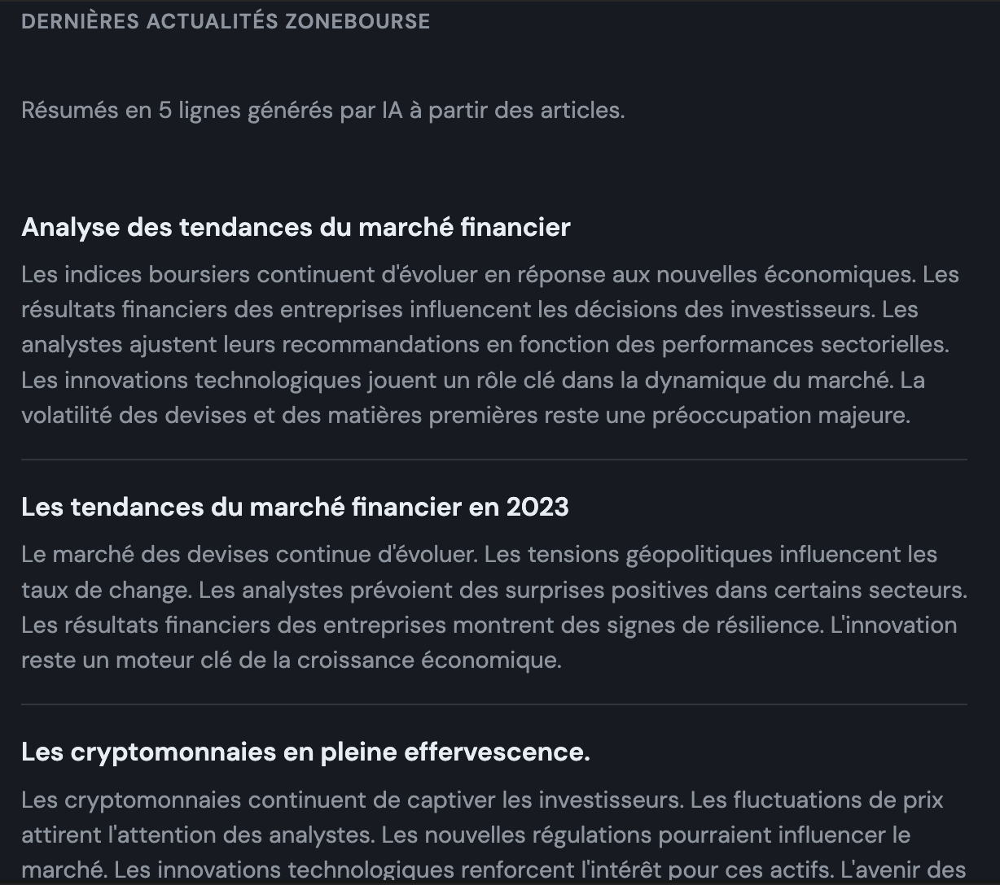

# eToro Interface

Interface web pour visualiser le profil d'un trader eToro, comparer les performances avec des indices (S&P 500, NASDAQ 100, CAC 40 TR, MSCI World) et lister les instruments par place de marché.

## Fonctionnalités

- **Profil trader** : affichage du profil, des gains mensuels/annuels et du portefeuille
- **Comparaison des performances** : courbes comparatives (base 100) avec possibilité d'ajouter les 100 traders les plus copiés
- **Indices** : S&P 500, NASDAQ 100, CAC 40 TR, MSCI World
- **Simulation DCA** : 1 000 $ au départ + 100 $/mois, comparaison avec le S&P 500
- **Instruments par place de marché** : liste des actions et instruments disponibles sur eToro

## Prérequis

- Python 3.10+
- Compte eToro vérifié avec clés API

## Installation

```bash
# Cloner le projet
cd etoro_interface

# Créer l'environnement virtuel
python3 -m venv venv

# Activer l'environnement
source venv/bin/activate   # macOS/Linux
# ou : venv\Scripts\activate   # Windows

# Installer les dépendances
pip install -r requirements.txt
```

## Configuration

Créer un fichier `.env` à la racine :

```env
ETORO_API_KEY=ta_clé_api_publique
ETORO_USER_KEY=ta_clé_utilisateur
```

Les clés se génèrent dans **Paramètres > Trading > Gestion des clés API** sur eToro.

## Lancement

```bash
python app.py
```

Ouvrir [http://127.0.0.1:5001](http://127.0.0.1:5001) dans le navigateur.

## Structure

```
etoro_interface/
├── app.py              # Application Flask
├── etoro_client.py     # Client API eToro
├── requirements.txt
├── templates/
│   └── profile.html    # Interface
└── .env                # Clés API (à créer)
```

## Configuration du trader

Par défaut, le profil affiché est **RomainRoth**. Pour modifier, éditer dans `app.py` :

```python
TRADER_USERNAME = "NomDuTrader"
```

## API eToro

- [Documentation officielle](https://api-portal.etoro.com/)
- Base URL : `https://public-api.etoro.com/api/v1/`

## Actualités Zonebourse

L’interface affiche les **3 dernières actualités Zonebourse** : le texte des articles est récupéré (BeautifulSoup), puis OpenAI génère un **titre** et un **résumé en 5 lignes** pour chaque article.

### Source des données (URLs)

Les actualités sont récupérées depuis Zonebourse via les URLs suivantes (définies dans `zone_bourse/news_fetcher.py`) :

| Usage | URL |
|-------|-----|
| **Page listing** (liste des derniers articles) | `https://www.zonebourse.com/actualite-bourse/` |
| **Un article** (format) | `https://www.zonebourse.com/actualite-bourse/{slug-titre}-{id}` |

Exemple d’URL d’article :  
`https://www.zonebourse.com/actualite-bourse/les-bourses-europeennes-rebondissent-apres-deux-seances-dans-le-rouge-ce7e5cd3df81f627`

Le code parse le HTML de la page listing pour extraire les liens vers les 3 derniers articles, puis charge chaque page d’article pour en extraire le texte (JSON-LD `articleBody` ou sélecteurs DOM). Si la page listing ne renvoie pas de liens, des URLs d’articles de secours (fallback) sont utilisées.

### Résumé avec OpenAI

Une fois le texte de l’article extrait, il est envoyé à l’API OpenAI avec un **prompt** pour générer un titre et un résumé en 5 lignes. Le prompt utilisé est la constante `SUMMARY_PROMPT` dans `zone_bourse/news_fetcher.py`, **lignes 21-29** :

```python
SUMMARY_PROMPT = """Tu es un rédacteur financier. Voici le texte d'un article boursier.

Réponds UNIQUEMENT en JSON valide avec exactement deux clés :
- "titre" : un titre court et percutant (une phrase).
- "resume" : un résumé en exactement 5 lignes (5 phrases courtes, une par ligne, séparées par des retours à la ligne).

Article :

"""
```

Le modèle utilisé est **gpt-4o-mini**. La réponse JSON est parsée pour afficher le titre et le résumé dans l’interface. La clé API est lue depuis la variable d’environnement `OPENAI_API_KEY` (fichier `.env`).



### Quand ça marche

Tu vois des titres comme « Analyse des tendances du marché financier », « Les tendances du marché financier en 2023 », « Les cryptomonnaies en pleine effervescence », avec des résumés en 5 lignes sur des thèmes boursiers / marchés / crypto. Dans ce cas, le flux a bien :

1. Récupéré 3 pages Zonebourse (ou les URLs de secours)
2. Extrait le texte avec BeautifulSoup
3. Envoyé le texte à OpenAI avec le prompt configuré
4. Affiché les titres et résumés en 5 lignes renvoyés par l’API

Si le contenu te paraît un peu générique, c’est soit parce que les articles scrapés étaient courts / peu détaillés, soit parce que le modèle a un peu « lissé » le texte.

### Quand ça échoue (message par défaut)

Les textes **par défaut** (quand tout échoue) sont :

- **Titres** : « Actualité 1 (exemple) », « Actualité 2 (exemple) », « Actualité 3 (exemple) »
- **Résumés** : des phrases du type « Le chargement des articles Zonebourse a échoué… », « Vous pouvez tester avec des fichiers HTML locaux… », etc.

### Vérifier la source

Pour vérifier que les données viennent bien de l’API (et non des placeholders), ouvre :

**http://127.0.0.1:5001/api/zonebourse-news-debug**

et regarde si les champs `title` / `summary` correspondent à ce que tu vois sur la page (et qu’il n’y a pas « (exemple) » dans les titres).

---

## 1️⃣ À quoi sert Werkzeug

Werkzeug fournit les briques techniques bas niveau pour un serveur web Python.

Par exemple :

- gérer les requêtes HTTP
- gérer les réponses HTTP
- gérer les cookies
- parser les formulaires
- router les URLs
- gérer les headers

En résumé :

```
navigateur
     ↓
requête HTTP
     ↓
Werkzeug analyse la requête
     ↓
ton application Python
     ↓
Werkzeug renvoie la réponse HTTP
```

## 2️⃣ Exemple simple avec Werkzeug

```python
from werkzeug.wrappers import Request, Response
from werkzeug.serving import run_simple

@Request.application
def application(request):
    return Response("Hello World")

run_simple("localhost", 5000, application)
```

Quand tu vas sur `http://localhost:5000`, le navigateur reçoit : **Hello World**.

## 3️⃣ Pourquoi Flask utilise Werkzeug

Flask est construit au-dessus de Werkzeug.

Structure simplifiée :

```
Flask
   ↓
Werkzeug
   ↓
WSGI
   ↓
serveur web
```

Donc Flask utilise Werkzeug pour :

- analyser les requêtes
- gérer les routes
- créer les réponses HTTP

## 4️⃣ Ce que contient Werkzeug

| Module      | Fonction                    |
|------------|-----------------------------|
| routing    | gestion des routes          |
| wrappers   | objets Request / Response   |
| serving    | serveur de développement    |
| exceptions | erreurs HTTP                |
| utils      | fonctions utiles            |

## 5️⃣ Werkzeug et WSGI

Werkzeug implémente WSGI. WSGI est une norme qui relie un serveur web et une application Python.

Architecture :

```
Nginx / Apache
       ↓
WSGI
       ↓
Werkzeug
       ↓
Application Python
```

## 6️⃣ Pourquoi utiliser Werkzeug directement

Les développeurs l’utilisent quand ils veulent :

- créer leur propre framework web
- comprendre comment fonctionne Flask
- faire des outils HTTP personnalisés

## ✅ Résumé

| Question            | Réponse                    |
|---------------------|----------------------------|
| Qu'est-ce que Werkzeug | bibliothèque web Python  |
| À quoi ça sert      | gérer requêtes et réponses HTTP |
| Framework complet   | non                        |
| Utilisé par         | Flask                      |
| Niveau              | bas niveau                 |

*Si tu veux, on peut aussi voir pourquoi Flask + Werkzeug + Jinja2 est l’architecture utilisée par beaucoup de startups, et comment créer ton propre mini-framework web en 40 lignes.*
